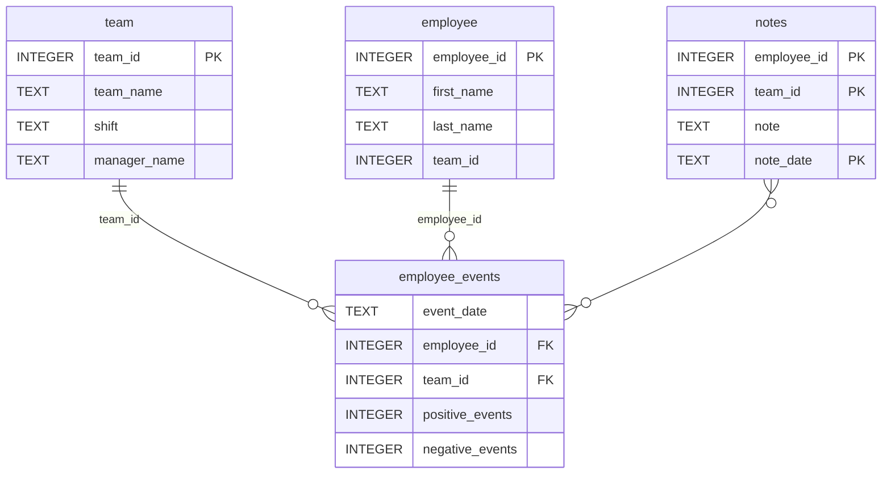

# Software Engineering for Data Scientists 

This repository contains starter code for the **Software Engineering for Data Scientists** final project. Please reference your course materials for documentation on this repository's structure and important files. Happy coding!

## Getting Started

### Prerequisites

- **Python 3.10 or higher.** `requirements.txt` pins `scikit-learn==1.5.2`, which requires Python 3.9+.
- `git`

### Setup

1. Clone your fork of this repository:

   ```bash
   git clone https://github.com/DokurOmkar/dsnd-dashboard-project.git
   cd dsnd-dashboard-project
   ```

2. Create and activate a virtual environment:

   ```bash
   python -m venv env
   source env/bin/activate
   ```

   or with conda:

   ```bash
   conda create -n dsnd-dashboard python=3.10 -y
   conda activate dsnd-dashboard
   ```

3. Install dependencies. This also installs the local `employee_events` package in editable mode (via the `-e python-package` line in `requirements.txt`):

   ```bash
   pip install -r requirements.txt
   ```

4. Build the distributable package and confirm it works:

   ```bash
   cd python-package
   python setup.py sdist
   cd ..
   python -c "from employee_events import Employee; print(Employee().names()[:2])"
   ```

   A `.tar.gz` file should now exist in `python-package/dist/`, and the command should print a list of employee names.

5. Run the test suite:

   ```bash
   pytest tests/ -v
   ```

   All 4 tests should pass.

### Running the dashboard

`python-fasthtml==0.8.0` has two known bugs in its own shipped code that surface when it's installed alongside current `fastcore`/`starlette` releases (both are pinned older in `requirements.txt`, but these two bugs live inside `fasthtml` itself, so pinning doesn't fix them). Apply this one-time fix before running the app:

1. Add a missing `typing.Any` import in `fasthtml/fastapp.py` (fixes `NameError: name 'Any' is not defined` on startup):

   ```bash
   python -c "import pathlib; p = pathlib.Path(__import__('fasthtml').__file__).parent / 'fastapp.py'; s = p.read_text(); p.write_text(s.replace('import inspect,uvicorn', 'import inspect,uvicorn\nfrom typing import Any'), encoding='utf-8')"
   ```

2. Fix a positional-vs-keyword argument bug in `fasthtml/core.py` (fixes `TypeError: sequence item 1: expected str instance, bool found` when rendering any page):

   ```bash
   python -c "import pathlib; p = pathlib.Path(__import__('fasthtml').__file__).parent / 'core.py'; s = p.read_text(); old = 'def _to_xml(req, resp, indent):\n    resp = _apply_ft(resp)\n    _find_targets(req, resp)\n    return to_xml(resp, indent)'; new = old.replace('to_xml(resp, indent)', 'to_xml(resp, indent=indent)'); p.write_text(s.replace(old, new), encoding='utf-8') if old in s else print('already patched')"
   ```

3. Start the app:

   ```bash
   cd report
   python dashboard.py
   ```

Visit `http://localhost:5001/` in your browser. Try `http://localhost:5001/employee/2` and `http://localhost:5001/team/1` as well.

### Repository Structure
```
├── README.md
├── assets
│   ├── model.pkl
│   └── report.css
├── env
├── python-package
│   ├── employee_events
│   │   ├── __init__.py
│   │   ├── employee.py
│   │   ├── employee_events.db
│   │   ├── query_base.py
│   │   ├── sql_execution.py
│   │   └── team.py
│   ├── requirements.txt
│   ├── setup.py
├── report
│   ├── base_components
│   │   ├── __init__.py
│   │   ├── base_component.py
│   │   ├── data_table.py
│   │   ├── dropdown.py
│   │   ├── matplotlib_viz.py
│   │   └── radio.py
│   ├── combined_components
│   │   ├── __init__.py
│   │   ├── combined_component.py
│   │   └── form_group.py
│   ├── dashboard.py
│   └── utils.py
├── requirements.txt
├── start
├── tests
    └── test_employee_events.py
```

### employee_events.db


